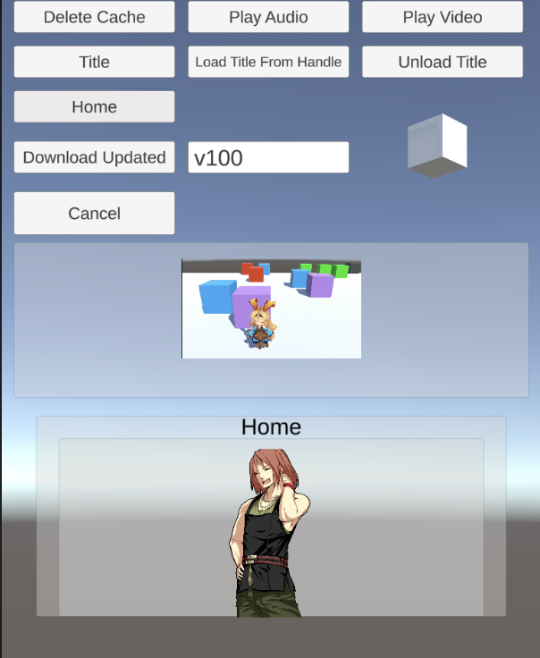

# ABAssetLoader

* 作者が Addressable を調査する過程で、過去にふれた AssetBundle を利用した機能をまとめたもの
* Unity 公式が推奨するように、 AssetBundle を利用するよりも Addressable を使うべきだが、そのバックボーンの機能を理解する手がかりになるかもしれない

## 概要

* AssetBundle を利用したアセットの動的ロード機能群
* `AssetDatabase.LoadAssetAtPath` と同様に、パスを指定してロード対象を指定する
* 更新されたバンドルを検知してダウンロードできる

### 機能

* AssetBundle からアセットを動的ロード
* 参照カウントを使ったメモリ管理
  * バンドル内のアセットをロードするとカウントが増える
  * バンドル内のアセットをアンロードするとカウントが減り、0になるとバンドルをアンロードする
* ソーシャルゲームのアセットワークフローを想定したバンドルのダウンロード
  * ダウンロードしたバンドルは `Application.persistentDataPath` 以下に保存する
  * 更新されたバンドルを検知し、サイズを計算し、ダウンロードする

### 動作バージョン

* Unity 2022.3.5f で確認済み

### 未対応事項

* ホスティングされたアセットサーバからのダウンロード

### 使用ライブラリ・フレームワーク

* 本リポジトリ内のコードは以下のライブラリ・フレームワーク・アセットを利用している

#### ランタイム

* [UniTask](https://github.com/Cysharp/UniTask)

#### サンプル

* [UniRx](https://github.com/neuecc/UniRx)
* [SDユニティちゃん 3Dモデルデータ](https://unity-chan.com/download/releaseNote.php?id=SDUnityChan)
* [Unity-Chan! コーゲンシティ・オールスターズ キャラクター立ち絵パック Vol.2](https://unity-chan.com/download/releaseNote.php?id=CogenCityAllStarsPortraitsVol2)

© Unity Technologies Japan/UCL

## パッケージの作成

**※注意: パッケージを作成するとき、同名のフォルダの中身は全て削除される**

### 初期バージョンの作成

1. Unity のメニューから `Window > ABAssetLoader > AssetBundleBuilder の起動` を選択する
2. `バンドル一覧の読み込み` を押す
3. パッケージに含めるバンドルを選択する
4. `初期バージョンとして作成` を ON にする
    * ビルドされたバンドルは StreamingAssets 以下に生成される
5. `パッケージを作成` ボタンを押し、 StreamingAssets 内に以下の内容があることを確認する
    * 指定したバンドル
    * ContentsTable.json
    * VersionManifest.json

設定例|出力結果
-|-
|

### パッケージの作成

1. Unity のメニューから `Window > ABAssetLoader > AssetBundleBuilder の起動` を選択する
2. `バンドル一覧の読み込み` を押す
3. パッケージに含めるバンドルを選択する
4. パッケージ名を入力する
    * ビルドされたバンドルはこのパッケージフォルダ以下に生成される
5. パッケージの出力先を選択する
6. ビルド対象の OS を選択する
7. `パッケージを作成` ボタンを押し、出力されたフォルダに以下の内容があることを確認する
    * 指定したバンドル
    * ContentsTable.json
    * VersionManifest.json

設定例|出力結果
-|-
 | 

## Public API

### AssetLoadManager

* AssetBundle を使った動的ロード・アンロードを行う

メソッド名|説明
-|-
UniTask Setup (CancellationToken) | アセットやバンドルを読み込むために必要な情報を構築する。**注:AssetLoader の機能を使うときは、最初にこのメソッドを手動で呼ぶ。**
UniTask DownloadPackage(bool unloadAllObjects = true, Action\<BundleVersion\> onDownloaded = null, CancellatonToken) | Version に対応したパッケージ内の `AssetBundle` をダウンロードする。 `onDownloaded` 引数を渡すと、パッケージ内のバンドルを全てダウンロードしたときコールバックを呼び出せる。 `unloadAllObjects` は内部で [AssetBundle.UnloadAllAssetBundles](https://docs.unity3d.com/2022.3/Documentation/ScriptReference/AssetBundle.UnloadAllAssetBundles.html) を呼ぶときに渡される。
UniTask\<LoadedAssetHandle\> LoadAssetAsync (string assetPath, CancellationToken) | assetPath が指すアセットを持つバンドルをロードし、バンドル内部のアセットをロードする
void UnloadAsset (LoadedAssetHandle handle) | `LoadedAssetHandle.Key` が参照するアセットの参照カウントを減らす。参照カウントが 0 になると `AssetBundle` がメモリからアンロードされる。
void UnloadAll (bool unloadAllObjects = true) | ロード済みの全てのアセットと AssetBundle をアンロードする。`unloadAllObjects` は内部で [AssetBundle.UnloadAllAssetBundles](https://docs.unity3d.com/2022.3/Documentation/ScriptReference/AssetBundle.UnloadAllAssetBundles.html) を呼ぶときに渡される。
void DeleteBundleCache (bool unloadAllObjects = true) | ダウンロードした AssetBundle を全て削除する`unloadAllObjects` は内部で [AssetBundle.UnloadAllAssetBundles](https://docs.unity3d.com/2022.3/Documentation/ScriptReference/AssetBundle.UnloadAllAssetBundles.html) を呼ぶときに渡される。

### AssetBundleDownloader

* パッケージ単位でバンドル群をダウンロードする
  * パッケージは `v101` のようにバージョンごとに作成する  
* ダウンロードしたバンドルは Application.PersistentDataPath に保存される
* 既にダウンロードしたバンドルの更新時刻とハッシュを比較し、バンドルをダウンロードすべきか判断する

メソッド名|説明
-|-
UniTask DownloadPackage(Action\<BundleVersion\> onDownloaded = null, CancellatonToken) | Version に対応したパッケージ内の `AssetBundle` をダウンロードする。 `onDownloaded` 引数を渡すと、パッケージ内のバンドルを全てダウンロードしたときコールバックを呼び出せる。
UniTask\<long\> CalculateDownloadSize(CancellationToken)| 既にダウンロードしたバンドルを基準に、Version に対応したパッケージに含まれるダウンロードが必要なデータサイズを取得する

### LoadedAssetHandle

* バンドルからロードしたアセットの参照を持つもの
* `AssetLoadManager.LoadAssetAsync` を呼ぶと取得できる
* `AssetLoadManager.UnloadAsset` にはこれを渡す
* **注意1: AssetLoader はこのハンドルを使って参照カウントを正しく計測する。**
  * **不要になったアセットは `AssetLoadManager.UnloadAsset` を呼んで参照カウントを減らす。**
* **注意2: `AssetLoadManager.UnloadAll` や `AssetLoadManager.DeleteBundleCache` を呼ぶと、ハンドルが参照するアセットや AssetBundle は全てアンロードされる。**

メソッド名|説明
-|-
Object Asset | バンドルからロードしたアセット
string Key | アセットが所属するバンドルに対応する文字列。このキー毎に参照カウントを計測している。

### ABAssetLoaderSetting

* ABAssetLoader の挙動設定に必要なプロパティ群

プロパティ名 / 初期値|説明
-|-
string RemotePackageName = string.Empty | リモートサーバの最新バージョンのパッケージを指す。 **リモートサーバの最新バージョンが変わったとき、このプロパティを更新する必要がある。**
int DownloadTimeoutSeconds = 3000 | `AssetBundleDownloader.DownloadPackage` でファイルをダウンロードするときのタイムアウト時間
int? EmulateLoadingBundleDelayMilliseconds = null | 指定した時間分、 AssetBundle をロードするときにかかる時間を延長する。長時間の非同期ロードを再現するために利用できる。
int? EmulateLoadingAssetDelayMilliseconds = null | 指定した時間分、 AssetBundle からアセットをロードするときにかかる時間を延長する。長時間の非同期ロードを再現するために利用できる。
int? EmulateDownloadDelayMilliseconds = null | 指定した時間分、 `AssetBundleDownloader.DownloadPackage` でファイルをダウンロードするときにかかる時間を延長する。長時間の非同期ロードを再現するために利用できる。

## 詳細

### 構成

名前|説明
-|-
AssetLoadManager | 各種処理のエントリーポイント
AssetBundleAssetLoader | アセットバンドルと内部のアセットのロード
AssetBundleContentsTable | assetPath が指すアセットを持つ AssetBundle 名のテーブル
AssetBundleDownloader | バンドルのダウンロード
AssetBundleLocator | streaming / persistent / remote のどこにバンドルがあるかを区別して UnityWebRequest で使うパスを発行する
VersionManifest | 現在のバージョンのバンドル情報をまとめたもの

### 処理フロー: 起動〜アセットのロード

### 処理フロー: パッケージのダウンロードとキャッシュ削除

## Sample シーンのデータ更新フロー

* Sample シーンでは以下のようなビルトインと2つの更新パッケージを使った動作を確認できる
  * **太字** は前のバージョンから新規追加or更新されたことを表す
  * () の中は最後に更新されたバージョン

ビルトイン|v100|v101
-|-|-
AssetBundles AssetBundles.manifest ui_title movie ContentsTable.json VersionManifest.json|**AssetBundles (v100)** **AssetBundles.manifest (v100)** **VersionManifest.json (v100)** **ContentsTable.json (v100)** **audio (v100)** movie **ui_home (v100)** ui_title|**AssetBundles (v101)** **AssetBundles.manifest (v101)** **VersionManifest.json (v101)** **ContetnsTable.json (v101)** audio (v100) movie  **ui_home (v101)** **ui_title (v101)**

### Sample シーンの操作

* 縦持ちスマートフォン画面のレイアウト(750x1334)を想定している

画面|説明
-|-
|①ダウンロードしたデータを削除 ②`audio` から `Audio1.wav` をロード生成して再生 ③`movie` から `Movie1.mov` をロード生成して再生 ④`ui_title` から `Title.prefab` をロードして表示 ⑤ロードしたときキャッシュした Handle から表示 ⑥`ui_title` から `Title.prefab` をアンロード ⑦`ui_home` から `Home.prefab` をロード生成して表示 ⑧パッケージをダウンロードする ⑨`Download Updated` でダウンロードするパッケージ名を指定する ⑩各種非同期処理をキャンセルする

### データ更新フロー

#### v100 ダウンロード前

* 最初は Persistent には何も入ってない

Streaming | Persistent
-|-
AssetBundles AssetBundles.manifest ui_title movie ContentsTable.json VersionManifest.json| 

* Title や Video は表示できるが、 Home や Audio はまだデータがないので扱えない

#### v100 ダウンロード後

* v100 で新規追加された `ui_home` と `audio` が追加される
* v100 パッケージ作成時、 `AssetBundles・ContentsTable・VersionManifest` は更新されるので DL 対象になる
  * DL によって Persisntet にはいる
  * Streaming と Persistent 両方にあるデータは Persistent が優先される

Streaming | Persistent
-|-
AssetBundles AssetBundles.manifest ui_title movie ContentsTable.json VersionManifest.json |**AssetBundles** **AssetBundles.manifest** **ui_home** **audio** **ContentsTable.json** **VersionManifest.json**

* Home や Audio がダウンロードされ扱えるようになる

### v100 をダウンロードした後に v101 をダウンロード

* v101 で更新された `ui_title` が DL され、 Persistent に新規に追加される
  * Streaming と Persistent 両方にあるデータは Persistent が優先されるので、更新後の `ui_title` を参照する
* v101 で更新された `ui_home` は既存の Persistent にあるものを上書きして DL する
* `audio` は `v100` から変わってないので更新されない

Streaming | Persistent
-|-
AssetBundles AssetBundles.manifest ui_title movie ContentsTable.json VersionManifest.json|**AssetBundles** **AssetBundles.manifest** **ui_title** **ui_home** audio **ContentsTable.json** **VersionManifest.json**

* データの更新により Title や Home で表示される画像が変わっている

